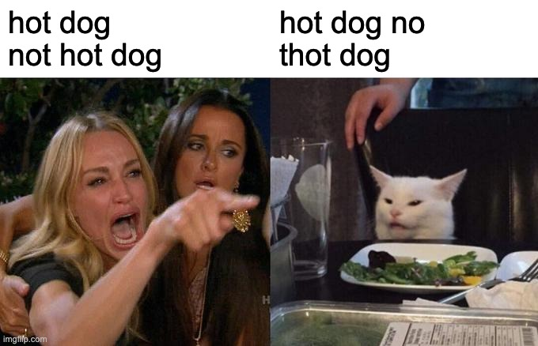
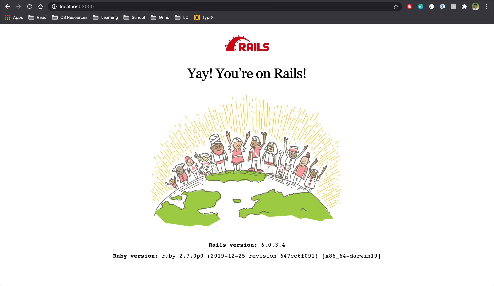
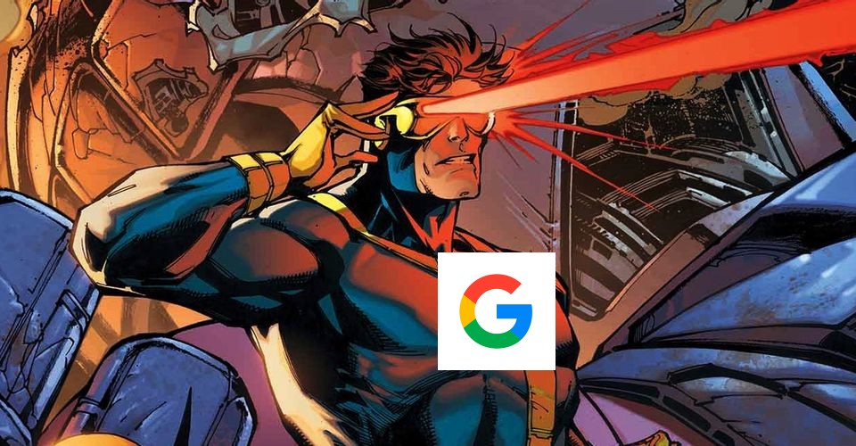

# hotdognothotdog (🌭!🌭)

A tutorial for those learning Ruby on Rails who want to build the Shazam™ for food instead of [yet another blog app](https://www.railstutorial.org/book)<sup>[1](#footnote-one)</sup>. Inspired by the [SeeFood app](https://silicon-valley.fandom.com/wiki/SeeFood) created by the legendary [Jian-Yang](https://silicon-valley.fandom.com/wiki/J%C3%ACan-Y%C3%A1ng).



## Prerequisites

- Ruby 2.7.0. An easy way to install a specific version of Ruby is to use [RVM](https://www.ruby-lang.org/en/news/2019/12/25/ruby-2-7-0-released/). Install RVM on your machine and run the following commands.

```bash
$ rvm install ruby-2.7.0
$ rvm use 2.7.0
```

- Ruby on Rails 6

```bash
$ gem install rails
```

Ensure that you are using ruby 2.7 and rails 6 by running the following command line commands.

```bash
$ ruby --version
$ rails --version
```

## Step 1: Initialize New Rails App

Generate a new project folder and starting files by running

```bash
$ rails new hotdognothotdog
```

This process can take a few minutes to complete. After the new rails project is created, change your working directory to the new `hotdognothotdog` directory.

```bash
$ cd hotdognothotdog
```

Ensure that we have everything set up correctly up until this point by attempting to start the rails web server.

```bash
$ bundle exec rails server
```

You should see the following text in your terminal

```bash
bundle exec rails server
=> Booting Puma
=> Rails 6.0.3.4 application starting in development
=> Run `rails server --help` for more startup options
Puma starting in single mode...
* Version 4.3.6 (ruby 2.7.0-p0), codename: Mysterious Traveller
* Min threads: 5, max threads: 5
* Environment: development
* Listening on tcp://127.0.0.1:3000
* Listening on tcp://[::1]:3000
Use Ctrl-C to stop
```

and the following webpage if you go to `localhost:3000` from any web browser



If you see this page, 🎉 woooo! Let's save our progress with `git` by creating a new git commit.

```bash
$ git add .
$ git commit -m "Initialize hotdognothotdog project"
```

## Step 2: Root Webpage

```ruby
Rails.application.routes.draw do
  # For details on the DSL available within this file, see https://guides.rubyonrails.org/routing.html
  root to: 'hotdog#index'
end
```

```bash
$ rails generate controller Hotdog
```

```bash
$ touch app/views/hotdog/index.html.erb
```

```ruby
<h1>hotdognothotdog</h1>
```

```ruby
class HotdogController < ApplicationController
  def index
  end
end
```

## Step 3: Uploading a Picture

```ruby
Rails.application.routes.draw do
  # For details on the DSL available within this file, see https://guides.rubyonrails.org/routing.html
  root to: 'hotdog#index'
  post 'upload', to: 'hotdog#upload'
end
```

```ruby
<h1>hotdognothotdog</h1>
<%= form_tag({:action => :upload}, :multipart => true) do %>
  <%= file_field_tag 'picture', onchange: 'form.submit()' %>
<% end %>
```

```ruby
class HotdogController < ApplicationController
  def index

  end

  def upload
    redirect_to root_path
  end
end
```

```bash
$ git add .
$ git commit -m "Implement image upload"
```

## Step 4: Google 👀 Cloud Vision 👀 API



Add the [google-cloud-vision ruby client library](https://github.com/googleapis/google-cloud-ruby/tree/master/google-cloud-vision) to the `Gemfile`

```ruby
gem 'google-cloud-vision'
```

```bash
$ bundle install
```


---
<a name="footnote-one">1</a>: You should definitely build yet another blog app because that is absolutely a better way to learn Ruby on Rails than 🌭!🌭™
